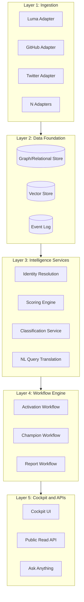
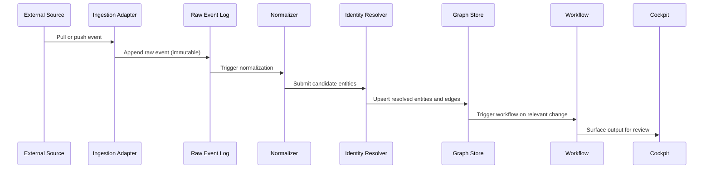
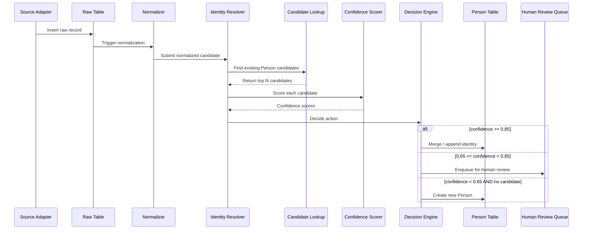
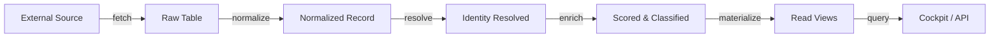
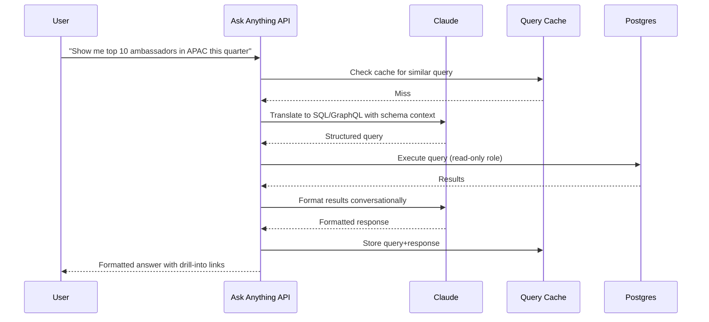

# Cursor Community Atlas

## Technical Specification v1.0

---

## 0. Document Purpose and Scope

This document specifies the design, data model, ingestion pipelines, query layer, extension model, and phased build plan for the Cursor Community Atlas. The Atlas is the foundational data and intelligence layer that converts ambient community signal across all public and (post-employment) internal Cursor surfaces into a queryable graph that supports organizer activation, champion identification, vertical community programs, and cross-functional signal pull.

This specification is the source of truth for the build. Every architectural decision, schema field, ingestion pipeline, and workflow downstream should trace back to a section of this document. Where ambiguity exists, it is named explicitly in Section 14: Open Questions.

The document is structured for a single engineer or a small team to execute against. It is not optimized for organizational consensus. It is optimized for clarity of contracts between components and clarity of phased delivery.

---

## 1. System Overview

### 1.1 Mission

Build the keystone data layer for the Cursor community function such that every downstream workflow (organizer activation, event lifecycle, champion routing, vertical programs, internal signal pull) composes off a single coherent graph of people, companies, events, communications, artifacts, programs, and signals.

### 1.2 Goals

1. Resolve identities across at least seven external sources and Cursor's internal data into one canonical Person node per individual.
2. Support sub-second graph queries up to three hops deep on a population of 100K+ Person nodes.
3. Provide a natural-language query interface that translates English questions into graph traversals with no manual SQL required for most queries.
4. Enable downstream workflows to be added as plugins without modifying the core data model.
5. Maintain an immutable audit trail of every decision the system makes (identity merges, classification, scoring, routing) so any output is reproducible and reviewable.

### 1.3 Non-goals

1. Be a CRM. The Atlas is a graph for intelligence and routing. It does not replace Salesforce or HubSpot for sales workflow.
2. Be a marketing automation tool. Outreach is drafted by the Atlas and routed through standard email/Slack tools, not delivered from the Atlas directly.
3. Be a public-facing product. The Atlas is internal infrastructure. The cockpit on top is an internal tool.
4. Solve identity resolution perfectly. The system aims for 95%+ accuracy with explicit handling of the remaining ambiguity rather than 100% accuracy at infinite cost.
5. Be a real-time system. Most ingestion is hourly or daily. Real-time is a Phase 5+ concern.

### 1.4 Glossary

| Term | Definition |
|---|---|
| Atlas | The complete system specified by this document |
| Entity | A first-class node type in the graph (Person, Company, Event, Communication, Artifact, Program, Signal) |
| Edge | A typed relationship between two entities |
| Canonical ID | The Atlas-internal stable UUID for an entity |
| Source ID | The identifier of the same entity in an external system (e.g., a Luma user ID) |
| Resolution | The process of determining that two source records refer to the same Person |
| Confidence Score | A 0-1 numerical estimate of how certain the system is about a resolution or classification |
| Workflow | A defined sequence of steps that produces a routine community ops output |
| Cockpit | The thin UI on top of the Atlas where operators query, review, and act |

---

## 2. Architecture

### 2.1 Layered Architecture

The Atlas is structured as five horizontal layers. Each layer has a defined contract with the layer above and below. Layers can be replaced or extended without touching neighboring layers as long as contracts are preserved.



**Layer 1: Ingestion.** Source adapters pull data from external systems on schedules or webhooks. Each adapter normalizes its source's data into a canonical internal representation before handing off to Layer 2. Adapters are independent and replaceable.

**Layer 2: Data Foundation.** The persistent store. Three sub-stores: a relational store for entities and relationships (Postgres), a vector store for embedding-based lookups (pgvector co-located in Postgres), and an append-only event log for state changes.

**Layer 3: Intelligence Services.** Stateful services that operate on the data foundation. Identity resolution. Scoring. Classification. Natural language query translation. Each service has a clear input/output contract and can be invoked from Layer 4 workflows or directly via the Read API.

**Layer 4: Workflow Engine.** The orchestration layer that executes workflows on schedules or triggers. Workflows compose intelligence services and produce concrete outputs (drafted outreach, briefings, reports). Each workflow is a defined DAG.

**Layer 5: Cockpit and APIs.** The operator interface and the read API for external consumers. The cockpit is a thin UI. The read API is REST + a GraphQL endpoint. Ask Anything is a special endpoint that translates natural language to query and returns formatted results.

### 2.2 Data Flow at a High Level



Every piece of data flows through this pipeline. The raw event log is the source of truth. Everything downstream is derived and can be rebuilt from the log.

### 2.3 Technology Choices

| Concern | Choice | Reasoning |
|---|---|---|
| Relational store | PostgreSQL 16 (via Supabase) | Mature, JSONB for flexibility, recursive CTEs for graph queries, pgvector co-located. Avoids Neo4j operational overhead for v1. |
| Vector store | pgvector | Co-located with relational data. No second database to operate. Sufficient for embedding-based identity matching at expected scale. |
| Event log | Postgres table with append-only writes | Same database, transactional consistency with the graph. Move to Kafka/Redpanda if scale demands. |
| Backend language | TypeScript (Node 20 LTS) | Matches existing Pulse/Buddy stack. Strong typing prevents schema drift. |
| Backend framework | Next.js 14 API routes | Co-located with cockpit frontend. Reduces operational surface. |
| Background jobs | Inngest | Durable workflow execution, retries, observability built in. Simpler than rolling your own queue. |
| Frontend | Next.js + Tailwind + shadcn/ui | Matches existing stack. Fast iteration. |
| Map view | Mapbox GL JS | Continuity with Buddy and Emotional Cartography. Best-in-class. |
| LLM | Anthropic Claude API (Sonnet 4 for bulk, Opus for reasoning) | Quality, structured output, large context. Cost-efficient at bulk scale. |
| Auth | Supabase Auth | One less system to operate. Adequate for internal tool. |
| Hosting | Vercel (frontend + API), Supabase (DB), Inngest Cloud (jobs) | Three managed services. No infrastructure to run. |

The technology choices are deliberately conservative. Postgres carries every storage concern in v1. Adding Neo4j, Kafka, or a separate vector database only when concrete performance evidence demands it. Senior-engineer discipline: avoid unjustified complexity.

---

## 3. Core Data Model

### 3.1 Design Principles

1. **Identity is the keystone.** Every observable behavior maps back to a canonical Person. The Person table is the most carefully designed table in the system.
2. **Source records are preserved.** Raw data from external sources is stored verbatim in source tables before being normalized. Reconstruction is always possible.
3. **Edges are first-class.** Relationships are not foreign keys. They are typed edges with their own properties (when observed, source, confidence).
4. **Time is everywhere.** Every fact in the graph has a `valid_from` and optionally `valid_to`. People change employers. Events happen at points in time. Signals decay.
5. **No destructive updates.** Updates are append-only. The current state of an entity is the latest projection of its history.
6. **Confidence is explicit.** Anything inferred (resolution, classification, scoring) carries a confidence score and provenance.

### 3.2 Entity Definitions

Seven entity types. Each is documented with its purpose, key fields, lifecycle, and relationships.

#### 3.2.1 Person

The most important entity. Every individual community member.

**Purpose.** Represent one human being. Aggregate all observations about that human across all sources.

**Lifecycle.** Created when first observed in any source. Never deleted. Marked inactive if no activity for 180 days.

**Key fields.**

```sql
CREATE TABLE person (
    id UUID PRIMARY KEY DEFAULT gen_random_uuid(),
    canonical_name TEXT NOT NULL,
    names_seen TEXT[] DEFAULT '{}',
    emails_seen TEXT[] DEFAULT '{}',
    primary_email TEXT,
    location_city TEXT,
    location_country TEXT,
    location_timezone TEXT,
    employer_company_id UUID REFERENCES company(id),
    employer_seen_at TIMESTAMPTZ,
    role TEXT,
    seniority TEXT CHECK (seniority IN ('junior', 'mid', 'senior', 'staff', 'principal', 'lead', 'manager', 'director', 'vp', 'cxo', 'founder', 'unknown')),
    vertical TEXT,
    languages TEXT[] DEFAULT '{}',
    persona_classification TEXT,
    persona_confidence NUMERIC(3,2),
    lifecycle_stage TEXT CHECK (lifecycle_stage IN ('lurker', 'engaged', 'event_attendee', 'event_host', 'ambassador_candidate', 'ambassador', 'regional_lead', 'champion', 'dormant', 'churned')),
    activity_score NUMERIC(5,2) DEFAULT 0,
    churn_risk NUMERIC(3,2) DEFAULT 0,
    first_observed_at TIMESTAMPTZ NOT NULL DEFAULT NOW(),
    last_observed_at TIMESTAMPTZ NOT NULL DEFAULT NOW(),
    is_active BOOLEAN DEFAULT TRUE,
    metadata JSONB DEFAULT '{}'
);

CREATE INDEX idx_person_employer ON person(employer_company_id);
CREATE INDEX idx_person_location ON person(location_country, location_city);
CREATE INDEX idx_person_lifecycle ON person(lifecycle_stage) WHERE is_active = TRUE;
CREATE INDEX idx_person_active_score ON person(activity_score DESC) WHERE is_active = TRUE;
CREATE INDEX idx_person_names_gin ON person USING gin(names_seen);
CREATE INDEX idx_person_emails_gin ON person USING gin(emails_seen);
```

**Platform identities** are stored in a separate table to support many-to-one without bloating the Person row:

```sql
CREATE TABLE person_platform_identity (
    id UUID PRIMARY KEY DEFAULT gen_random_uuid(),
    person_id UUID NOT NULL REFERENCES person(id) ON DELETE CASCADE,
    platform TEXT NOT NULL CHECK (platform IN ('twitter', 'github', 'linkedin', 'luma', 'slack', 'discord', 'forum', 'cursor_product', 'hackernews', 'reddit', 'youtube', 'email')),
    handle TEXT NOT NULL,
    platform_user_id TEXT,
    profile_url TEXT,
    follower_count INTEGER,
    verified BOOLEAN DEFAULT FALSE,
    observed_at TIMESTAMPTZ NOT NULL DEFAULT NOW(),
    resolution_confidence NUMERIC(3,2) DEFAULT 1.0,
    resolution_method TEXT CHECK (resolution_method IN ('explicit_link', 'heuristic_match', 'embedding_match', 'human_verified', 'self_reported')),
    UNIQUE(platform, handle),
    UNIQUE(platform, platform_user_id)
);

CREATE INDEX idx_ppi_person ON person_platform_identity(person_id);
CREATE INDEX idx_ppi_platform_handle ON person_platform_identity(platform, handle);
```

#### 3.2.2 Company

Where people work. Especially target enterprise accounts.

**Purpose.** Aggregate signal at the organization level. Map community activity to enterprise opportunity.

**Lifecycle.** Created when first referenced by a Person's employer field. Enriched over time as more Person nodes link to it.

**Key fields.**

```sql
CREATE TABLE company (
    id UUID PRIMARY KEY DEFAULT gen_random_uuid(),
    canonical_name TEXT NOT NULL UNIQUE,
    domain TEXT,
    aliases TEXT[] DEFAULT '{}',
    vertical TEXT CHECK (vertical IN ('finance', 'healthcare', 'defense', 'government', 'energy', 'retail', 'tech', 'media', 'manufacturing', 'consulting', 'education', 'legacy_modernization', 'startup', 'other')),
    employee_count_tier TEXT CHECK (employee_count_tier IN ('seed', 'startup', 'growth', 'midmarket', 'enterprise', 'fortune_500')),
    fortune_rank INTEGER,
    geographic_hq_city TEXT,
    geographic_hq_country TEXT,
    target_account_status TEXT CHECK (target_account_status IN ('not_target', 'prospect', 'active_opportunity', 'customer', 'churned')),
    enterprise_account_id TEXT,
    aggregate_seat_count INTEGER DEFAULT 0,
    aggregate_composer_adoption NUMERIC(3,2),
    first_observed_at TIMESTAMPTZ NOT NULL DEFAULT NOW(),
    last_updated_at TIMESTAMPTZ NOT NULL DEFAULT NOW(),
    metadata JSONB DEFAULT '{}'
);

CREATE INDEX idx_company_domain ON company(domain);
CREATE INDEX idx_company_vertical ON company(vertical);
CREATE INDEX idx_company_target ON company(target_account_status) WHERE target_account_status != 'not_target';
CREATE INDEX idx_company_aliases_gin ON company USING gin(aliases);
```

#### 3.2.3 Event

Every event that touches the Cursor community.

**Purpose.** Ground truth for in-person and virtual gatherings. Attendance data is the highest signal for organizer activation and champion identification.

**Lifecycle.** Created from Luma ingestion or manual entry. Status transitions from `scheduled` to `completed` automatically based on date.

**Key fields.**

```sql
CREATE TABLE event (
    id UUID PRIMARY KEY DEFAULT gen_random_uuid(),
    title TEXT NOT NULL,
    description TEXT,
    program_id UUID REFERENCES program(id),
    program_type TEXT CHECK (program_type IN ('cafe_cursor', 'hackathon', 'workshop', 'meetup', 'vertical_finance', 'vertical_healthcare', 'vertical_defense', 'campus', 'ambassador_internal', 'other')),
    event_format TEXT CHECK (event_format IN ('in_person', 'virtual', 'hybrid')),
    starts_at TIMESTAMPTZ NOT NULL,
    ends_at TIMESTAMPTZ,
    timezone TEXT,
    venue_city TEXT,
    venue_country TEXT,
    venue_name TEXT,
    venue_company_id UUID REFERENCES company(id),
    host_company_id UUID REFERENCES company(id),
    status TEXT CHECK (status IN ('proposed', 'scheduled', 'live', 'completed', 'cancelled')),
    registered_count INTEGER DEFAULT 0,
    attended_count INTEGER DEFAULT 0,
    repeat_attendee_count INTEGER DEFAULT 0,
    sentiment_score NUMERIC(3,2),
    source_url TEXT,
    luma_event_id TEXT UNIQUE,
    created_at TIMESTAMPTZ NOT NULL DEFAULT NOW(),
    updated_at TIMESTAMPTZ NOT NULL DEFAULT NOW(),
    metadata JSONB DEFAULT '{}'
);

CREATE INDEX idx_event_dates ON event(starts_at);
CREATE INDEX idx_event_program ON event(program_id);
CREATE INDEX idx_event_location ON event(venue_country, venue_city);
CREATE INDEX idx_event_status ON event(status);
```

#### 3.2.4 Communication

Every public post, message, or mention.

**Purpose.** Surface signal: what is the community saying, about what, with what sentiment, with what reach.

**Lifecycle.** Append-only. Old communications are archived but not deleted.

**Key fields.**

```sql
CREATE TABLE communication (
    id UUID PRIMARY KEY DEFAULT gen_random_uuid(),
    source_platform TEXT NOT NULL CHECK (source_platform IN ('twitter', 'reddit', 'hackernews', 'youtube', 'forum', 'slack_public', 'discord', 'linkedin', 'blog', 'podcast')),
    source_record_id TEXT NOT NULL,
    author_person_id UUID REFERENCES person(id),
    author_handle_raw TEXT NOT NULL,
    content_text TEXT NOT NULL,
    content_url TEXT,
    posted_at TIMESTAMPTZ NOT NULL,
    sentiment_score NUMERIC(3,2),
    topic_tags TEXT[] DEFAULT '{}',
    vertical_tags TEXT[] DEFAULT '{}',
    engagement_likes INTEGER DEFAULT 0,
    engagement_replies INTEGER DEFAULT 0,
    engagement_shares INTEGER DEFAULT 0,
    engagement_views INTEGER,
    is_about_cursor BOOLEAN DEFAULT FALSE,
    cursor_relevance_score NUMERIC(3,2),
    embedding VECTOR(1536),
    ingested_at TIMESTAMPTZ NOT NULL DEFAULT NOW(),
    UNIQUE(source_platform, source_record_id)
);

CREATE INDEX idx_comm_author ON communication(author_person_id);
CREATE INDEX idx_comm_posted ON communication(posted_at DESC);
CREATE INDEX idx_comm_topic_gin ON communication USING gin(topic_tags);
CREATE INDEX idx_comm_cursor_rel ON communication(cursor_relevance_score DESC) WHERE is_about_cursor = TRUE;
CREATE INDEX idx_comm_embedding ON communication USING ivfflat (embedding vector_cosine_ops) WITH (lists = 100);
```

#### 3.2.5 Artifact

Workshops, hackathon submissions, demo videos, internal docs, Rules templates, MCP configs.

**Purpose.** Track the durable outputs of the community. Workflow libraries, content amplification, vertical asset compounding all depend on this.

**Key fields.**

```sql
CREATE TABLE artifact (
    id UUID PRIMARY KEY DEFAULT gen_random_uuid(),
    artifact_type TEXT NOT NULL CHECK (artifact_type IN ('workshop_recording', 'hackathon_submission', 'demo_video', 'rules_template', 'mcp_config', 'agent_definition', 'blog_post', 'documentation', 'tutorial', 'case_study')),
    title TEXT NOT NULL,
    creator_person_id UUID REFERENCES person(id),
    derived_from_event_id UUID REFERENCES event(id),
    content_url TEXT,
    content_text TEXT,
    vertical_tags TEXT[] DEFAULT '{}',
    technical_tags TEXT[] DEFAULT '{}',
    is_public BOOLEAN DEFAULT TRUE,
    quality_score NUMERIC(3,2),
    embedding VECTOR(1536),
    created_at TIMESTAMPTZ NOT NULL DEFAULT NOW(),
    metadata JSONB DEFAULT '{}'
);

CREATE INDEX idx_artifact_creator ON artifact(creator_person_id);
CREATE INDEX idx_artifact_event ON artifact(derived_from_event_id);
CREATE INDEX idx_artifact_type ON artifact(artifact_type);
CREATE INDEX idx_artifact_tags_gin ON artifact USING gin(technical_tags);
```

#### 3.2.6 Program

A class of activity: Cafe Cursor, Hackathons, Workshops, Vertical Finance, Regional Lead Program, Ambassador Program.

**Purpose.** Aggregate events of the same type. Track program-level KPIs. Support program-specific scoring and workflows.

**Key fields.**

```sql
CREATE TABLE program (
    id UUID PRIMARY KEY DEFAULT gen_random_uuid(),
    name TEXT NOT NULL UNIQUE,
    program_type TEXT NOT NULL,
    owner_person_id UUID REFERENCES person(id),
    description TEXT,
    is_vertical BOOLEAN DEFAULT FALSE,
    vertical TEXT,
    active_cities TEXT[] DEFAULT '{}',
    target_cities TEXT[] DEFAULT '{}',
    kpis JSONB DEFAULT '{}',
    is_active BOOLEAN DEFAULT TRUE,
    created_at TIMESTAMPTZ NOT NULL DEFAULT NOW(),
    metadata JSONB DEFAULT '{}'
);
```

#### 3.2.7 Signal

Behavioral indicators tagged with timestamp. The atomic unit of derived intelligence.

**Purpose.** Decouple raw observations from interpretations. Allow scoring engines to reason over normalized signals rather than raw heterogeneous data.

**Key fields.**

```sql
CREATE TABLE signal (
    id UUID PRIMARY KEY DEFAULT gen_random_uuid(),
    person_id UUID NOT NULL REFERENCES person(id) ON DELETE CASCADE,
    signal_type TEXT NOT NULL CHECK (signal_type IN (
        'event_attended', 'event_hosted', 'public_post_about_cursor',
        'positive_sentiment', 'negative_sentiment', 'product_usage_spike',
        'churn_risk_indicator', 'employer_change', 'role_change',
        'enterprise_advocacy', 'feedback_submitted', 'feature_request',
        'workflow_contributed', 'community_help_provided', 'organizer_candidate_qualified'
    )),
    value NUMERIC,
    confidence NUMERIC(3,2) DEFAULT 1.0,
    observed_at TIMESTAMPTZ NOT NULL,
    source_communication_id UUID REFERENCES communication(id),
    source_event_id UUID REFERENCES event(id),
    source_artifact_id UUID REFERENCES artifact(id),
    decays_by TIMESTAMPTZ,
    metadata JSONB DEFAULT '{}'
);

CREATE INDEX idx_signal_person ON signal(person_id);
CREATE INDEX idx_signal_type_time ON signal(signal_type, observed_at DESC);
CREATE INDEX idx_signal_decay ON signal(decays_by) WHERE decays_by IS NOT NULL;
```

### 3.3 Relationship Model

Edges are stored in junction tables, each with its own properties. This pattern is more verbose than property graph models but offers query clarity, foreign key integrity, and trivial reasoning about cardinality.

#### 3.3.1 Person-to-Event (attendance)

```sql
CREATE TABLE person_event (
    id UUID PRIMARY KEY DEFAULT gen_random_uuid(),
    person_id UUID NOT NULL REFERENCES person(id) ON DELETE CASCADE,
    event_id UUID NOT NULL REFERENCES event(id) ON DELETE CASCADE,
    role TEXT NOT NULL CHECK (role IN ('organizer', 'co_organizer', 'speaker', 'attendee', 'registered_no_show', 'declined')),
    registered_at TIMESTAMPTZ,
    attended_at TIMESTAMPTZ,
    luma_role_raw TEXT,
    post_event_sentiment NUMERIC(3,2),
    post_event_feedback TEXT,
    UNIQUE(person_id, event_id, role)
);

CREATE INDEX idx_pe_person ON person_event(person_id);
CREATE INDEX idx_pe_event ON person_event(event_id);
CREATE INDEX idx_pe_role ON person_event(role);
```

#### 3.3.2 Person-to-Company (employment)

```sql
CREATE TABLE person_company (
    id UUID PRIMARY KEY DEFAULT gen_random_uuid(),
    person_id UUID NOT NULL REFERENCES person(id) ON DELETE CASCADE,
    company_id UUID NOT NULL REFERENCES company(id) ON DELETE CASCADE,
    role TEXT,
    seniority TEXT,
    is_current BOOLEAN DEFAULT TRUE,
    valid_from TIMESTAMPTZ,
    valid_to TIMESTAMPTZ,
    source TEXT CHECK (source IN ('linkedin', 'email_domain', 'self_reported', 'github_bio', 'luma_form')),
    confidence NUMERIC(3,2) DEFAULT 1.0,
    observed_at TIMESTAMPTZ NOT NULL DEFAULT NOW()
);

CREATE INDEX idx_pc_person_current ON person_company(person_id) WHERE is_current = TRUE;
CREATE INDEX idx_pc_company_current ON person_company(company_id) WHERE is_current = TRUE;
```

#### 3.3.3 Person-to-Person (network)

```sql
CREATE TABLE person_person_edge (
    id UUID PRIMARY KEY DEFAULT gen_random_uuid(),
    source_person_id UUID NOT NULL REFERENCES person(id) ON DELETE CASCADE,
    target_person_id UUID NOT NULL REFERENCES person(id) ON DELETE CASCADE,
    edge_type TEXT NOT NULL CHECK (edge_type IN ('mentions', 'replies_to', 'co_hosts_event', 'colleague_at_company', 'mentored_by', 'introduced_to')),
    strength INTEGER DEFAULT 1,
    first_observed_at TIMESTAMPTZ NOT NULL DEFAULT NOW(),
    last_observed_at TIMESTAMPTZ NOT NULL DEFAULT NOW(),
    metadata JSONB DEFAULT '{}',
    UNIQUE(source_person_id, target_person_id, edge_type)
);

CREATE INDEX idx_ppe_source ON person_person_edge(source_person_id, edge_type);
CREATE INDEX idx_ppe_target ON person_person_edge(target_person_id, edge_type);
```

#### 3.3.4 Other edge tables

The same pattern repeats for: `communication_mentions_person`, `communication_mentions_company`, `artifact_uses_artifact` (derivative artifacts), `program_managed_by_person` (regional leads, ambassadors), `event_part_of_program`.

Each follows the same template: source FK, target FK, typed properties, observation timestamps, uniqueness constraint where appropriate.

### 3.4 Schema Conventions

1. **All primary keys are UUIDs.** Auto-generated. Allows offline ID generation, sharding without coordination.
2. **All timestamps are TIMESTAMPTZ.** Stored UTC. Display layer handles timezone conversion.
3. **All enums use `CHECK` constraints.** Application code references the same string values. Migration is easier than enum types.
4. **JSONB metadata fields on every entity.** Anything not part of the schema yet has a place to land without migration.
5. **Soft delete via `is_active` flags.** No hard deletes. Audit trail integrity.
6. **Append-only history tables.** Major entity changes are recorded in `entity_history` tables before update.

### 3.5 Raw Source Tables

Before normalization, every external record is stored verbatim. These tables are the recovery point: the entire normalized graph can be rebuilt from raw tables.

```sql
CREATE TABLE raw_luma_event (
    id UUID PRIMARY KEY DEFAULT gen_random_uuid(),
    luma_event_id TEXT NOT NULL UNIQUE,
    raw_payload JSONB NOT NULL,
    ingested_at TIMESTAMPTZ NOT NULL DEFAULT NOW(),
    normalized_at TIMESTAMPTZ,
    normalization_status TEXT CHECK (normalization_status IN ('pending', 'success', 'failed', 'skipped')),
    normalization_error TEXT
);

CREATE TABLE raw_twitter_post (
    id UUID PRIMARY KEY DEFAULT gen_random_uuid(),
    tweet_id TEXT NOT NULL UNIQUE,
    raw_payload JSONB NOT NULL,
    ingested_at TIMESTAMPTZ NOT NULL DEFAULT NOW(),
    normalized_at TIMESTAMPTZ,
    normalization_status TEXT
);

-- Same pattern repeats for: raw_github_profile, raw_github_commit, raw_linkedin_profile,
-- raw_reddit_post, raw_hackernews_item, raw_youtube_video, raw_cursor_forum_post,
-- raw_cursor_product_event
```

The pattern is identical. Raw payload as JSONB. Source ID for deduplication. Normalization status to track pipeline state.

---

## 4. Identity Resolution

### 4.1 Problem Statement

The same human appears across multiple sources. Alice Chen is `alice_codes` on GitHub, `@alicebuilds` on Twitter, `alice.chen@jpmorgan.com` on Luma, `Alice Chen` in the Cursor product, and `Alice Chen, Senior Engineer at JPMorgan Chase` on LinkedIn. Without resolving these to one canonical Person, every downstream query is wrong by a factor of how fragmented the data is.

Identity resolution is the most architecturally critical component. The data foundation is only as good as its identity resolution. Get this right and everything compounds. Get it wrong and the system produces beautifully formatted nonsense.

### 4.2 Resolution Tiers

Three tiers, in order of confidence. The system attempts each in order and stops at the first that produces a confident match.

#### Tier 1: Explicit Linking

The user has authenticated multiple platforms against one identity. Examples: signing into Cursor product with GitHub OAuth. Connecting Slack workspace via email match to Cursor account. Filling out a Luma form with an email that matches an existing Person email.

**Confidence: 1.0.** Treated as ground truth.

#### Tier 2: Heuristic Matching

No explicit link exists, but a combination of signals strongly suggests a match. The heuristic algorithm:

```typescript
interface MatchCandidate {
  personId: string;
  candidateRecord: NormalizedRecord;
  signals: ResolutionSignal[];
}

interface ResolutionSignal {
  signalType: 'name_exact' | 'name_fuzzy' | 'email_exact' | 'email_domain' |
              'employer_match' | 'city_match' | 'timezone_overlap' |
              'github_link_in_bio' | 'twitter_link_in_bio' | 'linkedin_link_in_bio' |
              'mutual_connection' | 'event_co_attendance';
  weight: number;  // 0 to 1
  confidence: number;  // 0 to 1
}

function computeMatchConfidence(signals: ResolutionSignal[]): number {
  // Weighted average with non-linear boost for multiple corroborating signals
  const sumWeighted = signals.reduce((sum, s) => sum + (s.weight * s.confidence), 0);
  const sumWeights = signals.reduce((sum, s) => sum + s.weight, 0);
  const baseScore = sumWeighted / sumWeights;
  
  // Boost: corroboration premium
  const distinctSignalTypes = new Set(signals.map(s => s.signalType)).size;
  const corroborationBoost = Math.min(0.15, 0.03 * distinctSignalTypes);
  
  return Math.min(1.0, baseScore + corroborationBoost);
}
```

**Signal weights (tunable):**

| Signal | Weight |
|---|---|
| name_exact | 0.4 |
| name_fuzzy (Jaro-Winkler > 0.85) | 0.2 |
| email_exact | 0.95 |
| email_domain match + name match | 0.6 |
| github_link_in_bio | 0.85 |
| twitter_link_in_bio | 0.85 |
| linkedin_link_in_bio | 0.85 |
| employer_match | 0.3 |
| city_match | 0.2 |
| timezone_overlap | 0.1 |
| mutual_connection | 0.25 |
| event_co_attendance | 0.15 |

**Thresholds:**
- Confidence >= 0.85: auto-merge
- Confidence 0.65 - 0.85: surface to human review queue
- Confidence < 0.65: do not merge, log as candidate

#### Tier 3: Embedding-Based Matching

When heuristics produce ambiguous results, compare writing-style embeddings of communications. A Slack message from "Alice Chen" and a forum post from "alice_codes" can be matched if their writing embeddings are within 0.92 cosine similarity AND at least one supporting heuristic signal exists.

This tier is most useful for matching anonymous-handle accounts to known identities. It is also the most expensive (requires embedding generation and similarity search per candidate).

**Confidence formula:**

```typescript
function embeddingMatchConfidence(
  cosineSim: number,
  supportingSignals: ResolutionSignal[]
): number {
  // Embedding similarity alone is not enough. Require supporting signals.
  if (cosineSim < 0.85) return 0;
  if (supportingSignals.length === 0) return 0;
  
  const embeddingComponent = (cosineSim - 0.85) / 0.15;  // 0 to 1
  const supportingScore = supportingSignals.reduce((s, sig) => s + sig.weight * sig.confidence, 0);
  
  return Math.min(1.0, 0.5 + 0.3 * embeddingComponent + 0.2 * Math.min(1, supportingScore));
}
```

### 4.3 Resolution Workflow

Every new record from any source goes through this pipeline:



### 4.4 Audit Trail

Every resolution decision is logged immutably.

```sql
CREATE TABLE resolution_decision (
    id UUID PRIMARY KEY DEFAULT gen_random_uuid(),
    decided_at TIMESTAMPTZ NOT NULL DEFAULT NOW(),
    action TEXT NOT NULL CHECK (action IN ('merge', 'create_new', 'human_review', 'skip')),
    candidate_record_source TEXT NOT NULL,
    candidate_record_id TEXT NOT NULL,
    matched_person_id UUID REFERENCES person(id),
    confidence_score NUMERIC(3,2) NOT NULL,
    signals JSONB NOT NULL,
    decided_by TEXT NOT NULL CHECK (decided_by IN ('system', 'human')),
    human_reviewer TEXT,
    reasoning TEXT
);

CREATE INDEX idx_resolution_person ON resolution_decision(matched_person_id);
CREATE INDEX idx_resolution_time ON resolution_decision(decided_at DESC);
```

Every resolution is reproducible from this table. When a human disputes a merge ("these are two different people"), the system can replay the original signals and trace where the algorithm went wrong.

### 4.5 Conflict Resolution

When new evidence contradicts a prior merge, the system records the conflict and surfaces it for human review.

```sql
CREATE TABLE resolution_conflict (
    id UUID PRIMARY KEY DEFAULT gen_random_uuid(),
    detected_at TIMESTAMPTZ NOT NULL DEFAULT NOW(),
    person_id UUID NOT NULL REFERENCES person(id),
    conflicting_evidence JSONB NOT NULL,
    status TEXT CHECK (status IN ('pending_review', 'confirmed_merge', 'split_required', 'resolved')),
    resolved_at TIMESTAMPTZ,
    resolved_by TEXT,
    resolution_note TEXT
);
```

If a merge is invalidated, the Person is split. Splitting is non-trivial because edges may have been created on the merged identity. The split workflow re-evaluates each edge and reattaches to the correct Person.

---

## 5. Data Ingestion

### 5.1 Source Adapter Pattern

Every external data source is implemented as a source adapter. Adapters share a common interface:

```typescript
interface SourceAdapter<TRawRecord> {
  sourceName: string;
  
  // Fetch new records since last cursor
  fetch(cursor?: Cursor): AsyncIterable<TRawRecord>;
  
  // Store raw record verbatim
  storeRaw(record: TRawRecord): Promise<{ rawId: string }>;
  
  // Convert raw record to canonical normalized form
  normalize(rawId: string): Promise<NormalizedRecord[]>;
  
  // Rate limit configuration
  rateLimit: RateLimitConfig;
  
  // Idempotency key extraction
  idempotencyKey(record: TRawRecord): string;
}

interface NormalizedRecord {
  recordType: 'person' | 'event' | 'communication' | 'artifact' | 'company';
  sourcePlatform: string;
  sourceRecordId: string;
  payload: Record<string, unknown>;
  observedAt: Date;
}
```

This pattern allows:
- New sources to be added by implementing one interface
- Sources to be tested in isolation
- Failure of one source not blocking others
- Backfill via replay of raw records through normalization

### 5.2 Per-Source Specifications

#### 5.2.1 Luma Adapter

**Source.** Public Luma API + scraping of `luma.com/cursorcommunity`.

**Records.**
- Events: title, organizer, date, location, format, description, registration counts
- Attendees (where API permits): name, email, role, LinkedIn, Cursor tenure, use case, how-heard, demo interest, attendance mode

**Schedule.** Every 4 hours for events. Daily for attendee data.

**Rate limit.** 60 requests per minute.

**Normalization output.**
- 1 Event record per Luma event
- N Person records per attendee (each triggers identity resolution)
- N Person-Event edges (role: organizer, attendee, registered_no_show)
- Possible 1 Company record per attendee with LinkedIn employer

**Special handling.** The Luma form's "how_heard" field is captured as a signal of acquisition channel. The "main_use_case" field becomes a vertical_tag candidate. Demo interest becomes an `organizer_candidate_qualified` signal with a small but real weight.

#### 5.2.2 GitHub Adapter

**Source.** GitHub REST API v3 + GraphQL API v4.

**Records.**
- Profile: login, name, bio, location, company, blog URL, follower count, contribution graph
- Repositories: stars, languages, contribution patterns
- Public mentions of "cursor" in repos, issues, READMEs

**Schedule.** Weekly per known ambassador. Monthly per general user. Real-time for high-value mentions.

**Rate limit.** 5000 requests/hour authenticated. Use GraphQL where possible to batch.

**Normalization output.**
- 1 platform_identity record per GitHub login
- Updates to Person fields (location, employer if in profile)
- Artifact records for Cursor-related repos/READMEs
- Communications for repo descriptions/READMEs that mention Cursor

#### 5.2.3 Twitter/X Adapter

**Source.** Twitter API v2 or scraping via Apify if API constrained.

**Records.**
- Profile: handle, name, bio, location, follower count, verified status
- Tweets mentioning "cursor" or "@cursor_ai" (or scoped term lists)
- Tweet engagement metrics
- Replies, quotes, mentions

**Schedule.** Hourly search for Cursor mentions. Weekly profile refresh for ambassadors.

**Rate limit.** Depends on API tier. Plan for restrictive limits.

**Normalization output.**
- 1 platform_identity per Twitter handle
- Communication records for every tweet
- Person-Person edges for replies and mentions

#### 5.2.4 LinkedIn Adapter (Use Carefully)

**Source.** LinkedIn does not have an open API. Two options:
1. Manual research on top 300 ambassadors (Phase 1)
2. Phantombuster or Bright Data for scale (Phase 3+)

**Compliance.** LinkedIn's ToS restricts scraping. Use only for research with appropriate scale and respect rate limits aggressively.

**Records.** Profile: name, headline, current company, role, location, languages, education.

**Normalization output.** Updates to Person (employer, role, seniority, location, languages).

#### 5.2.5 Reddit Adapter

**Source.** Reddit API.

**Records.** Posts and comments mentioning Cursor in r/cursor, r/MachineLearning, r/LocalLLaMA, r/programming, r/webdev, r/learnprogramming.

**Schedule.** Hourly.

**Rate limit.** 60 requests/minute.

**Normalization output.**
- Communication record per post/comment
- Author resolution (Reddit usernames are notoriously hard to resolve, expect low resolution rate)

#### 5.2.6 Hacker News Adapter

**Source.** Algolia HN Search API. Free, generous.

**Records.** Every story or comment mentioning Cursor.

**Schedule.** Every 30 minutes.

**Rate limit.** No hard limit.

**Normalization output.**
- Communication record per HN item
- Author resolution via HN profile URL pattern

#### 5.2.7 YouTube Adapter

**Source.** YouTube Data API v3.

**Records.** Videos mentioning Cursor in title or description. Channel metadata.

**Schedule.** Daily.

**Rate limit.** 10,000 quota units/day. Each search costs 100 units.

**Normalization output.**
- Artifact record per video (type: tutorial)
- Person record per channel owner
- Communication record for the video description

#### 5.2.8 Cursor Forum Adapter

**Source.** Scrape `forum.cursor.com` (or whatever the canonical URL is).

**Records.** Forum posts, authors, topic tags, engagement metrics.

**Schedule.** Daily.

**Normalization output.**
- Communication record per post
- Person record per author

#### 5.2.9 Cursor Product Adapter (Post-Employment Only)

**Source.** Cursor's internal data warehouse, billing system, product analytics.

**Records.**
- User accounts: email, plan tier, signup date, last active
- Usage: Tab acceptance, time in app, model selection, Composer adoption percentage, MCP servers, custom Rules
- Billing: plan, seat count, billing entity (company)
- Feature adoption: Bugbot, Background Agents, Automations

**Schedule.** Daily incremental updates.

**Normalization output.**
- High-confidence Person resolution via email
- Workflow records per user pattern
- Signal records for engagement spikes, feature adoption, churn risk

### 5.3 Pipeline Orchestration

Inngest orchestrates all ingestion. Each adapter is a function. Schedules are declared in code:

```typescript
import { inngest } from './client';

export const fetchLumaEvents = inngest.createFunction(
  { id: 'luma-fetch-events', name: 'Fetch Luma Events' },
  { cron: '0 */4 * * *' },  // every 4 hours
  async ({ step }) => {
    const cursor = await step.run('get-cursor', async () => {
      return await getLastCursor('luma_events');
    });
    
    const events = await step.run('fetch', async () => {
      return await lumaAdapter.fetch(cursor);
    });
    
    for (const event of events) {
      await step.run(`store-${event.id}`, async () => {
        return await lumaAdapter.storeRaw(event);
      });
    }
    
    await step.run('trigger-normalization', async () => {
      return await triggerNormalization('luma_events');
    });
  }
);
```

Each step is durable. Failures retry with exponential backoff. State is recoverable on crash.

### 5.4 Idempotency and Retries

Every adapter must implement deterministic idempotency. Re-ingesting the same record produces the same outcome. This is achieved via:

1. **Idempotency keys.** Every source record has a stable external ID. Database unique constraints prevent duplicate raw records.
2. **Hash-based change detection.** A SHA-256 hash of the raw payload. If unchanged, normalization is skipped.
3. **Transactional normalization.** Normalization either fully succeeds (entity created/updated, edges written, status marked) or rolls back entirely.

Retries are handled by Inngest with exponential backoff (max 5 retries, max delay 1 hour).

### 5.5 Rate Limiting

Per-source rate limits are enforced at the adapter level using token-bucket algorithms. When a rate limit is hit, the adapter pauses and Inngest reschedules.

```typescript
class RateLimiter {
  constructor(private maxTokens: number, private refillPerSecond: number) {}
  
  async acquire(count: number = 1): Promise<void> {
    // Wait until count tokens are available
    // Refill at constant rate
  }
}
```

---

## 6. Data Routing and Transformation

### 6.1 The Pipeline: Raw → Normalized → Resolved → Enriched



Every record progresses through these stages. The stages are pipelined: a record can be in different stages at different times. Backfill is replay from any stage.

**Stage 1: Raw.** Verbatim source record stored in `raw_*` table. No interpretation.

**Stage 2: Normalized.** Field mapping to canonical schema. Type coercion. Validation. Missing optional fields are NULL. Validation failures move records to a quarantine table for inspection rather than discarding.

**Stage 3: Resolved.** Identity resolution applied. Person records merged or created. Edges written. Resolution decisions logged to audit trail.

**Stage 4: Enriched.** Scoring engines compute activity scores, churn risk, persona classification, organizer candidate qualification. Signals are generated from raw observations.

**Stage 5: Materialized.** Read-optimized views are kept fresh. Materialized views, cached aggregations, denormalized derived tables.

### 6.2 Event Sourcing Pattern

Every state-changing operation appends an event to the `entity_event_log`:

```sql
CREATE TABLE entity_event_log (
    id UUID PRIMARY KEY DEFAULT gen_random_uuid(),
    occurred_at TIMESTAMPTZ NOT NULL DEFAULT NOW(),
    entity_type TEXT NOT NULL,
    entity_id UUID NOT NULL,
    event_type TEXT NOT NULL,
    actor TEXT NOT NULL,
    payload JSONB NOT NULL,
    causation_id UUID,
    correlation_id UUID
);

CREATE INDEX idx_eel_entity ON entity_event_log(entity_type, entity_id, occurred_at);
CREATE INDEX idx_eel_correlation ON entity_event_log(correlation_id);
```

Examples of events:
- `person.created`
- `person.merged` (with merge_into_id)
- `person.classified` (with persona, confidence)
- `event.attendance_recorded`
- `signal.generated`
- `outreach.drafted`

The event log is the source of truth. Entity tables are projections. The graph can be reconstructed entirely from the log if needed.

### 6.3 Change Data Capture

Downstream services subscribe to entity events to trigger their own work. Inngest events propagate state changes:

```typescript
// Workflow subscribes to event
export const onPersonClassifiedAsOrganizerCandidate = inngest.createFunction(
  { id: 'on-organizer-candidate', name: 'Process Organizer Candidate' },
  { event: 'person.classified' },
  async ({ event, step }) => {
    if (event.data.newClassification === 'organizer_candidate') {
      await step.run('queue-for-outreach', async () => {
        return await queueOrganizerOutreachDraft(event.data.personId);
      });
    }
  }
);
```

CDC keeps the system reactive without polling.

### 6.4 Materialized Views

Read-heavy queries are precomputed:

```sql
CREATE MATERIALIZED VIEW mv_city_signal AS
SELECT
  p.location_city,
  p.location_country,
  COUNT(DISTINCT p.id) AS total_known_people,
  COUNT(DISTINCT CASE WHEN p.lifecycle_stage IN ('ambassador', 'regional_lead') THEN p.id END) AS ambassador_count,
  COUNT(DISTINCT e.id) AS event_count_last_180d,
  AVG(p.activity_score) AS avg_activity_score,
  COUNT(DISTINCT CASE WHEN c.posted_at > NOW() - INTERVAL '90 days' AND c.is_about_cursor THEN c.id END) AS recent_mentions
FROM person p
LEFT JOIN person_event pe ON p.id = pe.person_id
LEFT JOIN event e ON pe.event_id = e.id AND e.starts_at > NOW() - INTERVAL '180 days'
LEFT JOIN communication c ON c.author_person_id = p.id
WHERE p.location_city IS NOT NULL
GROUP BY p.location_city, p.location_country;

CREATE UNIQUE INDEX idx_mv_city_signal ON mv_city_signal(location_country, location_city);
```

Materialized views are refreshed on a schedule (every 15 minutes) or on demand. The cockpit reads from these views for instant response.

---

## 7. Query Layer

### 7.1 Read API

The Atlas exposes a REST API and a GraphQL endpoint. The cockpit consumes both. External integrations (e.g., GTM Salesforce push) consume the REST API.

**REST endpoints (selected):**

```
GET  /api/persons/:id
GET  /api/persons?employer=:companyId&lifecycle_stage=:stage&min_score=:n
GET  /api/persons/:id/network?depth=2&edge_types=mentions,co_hosts_event
GET  /api/persons/:id/timeline
GET  /api/companies/:id
GET  /api/companies/:id/champions
GET  /api/events/:id
GET  /api/events?city=:city&program_type=:type&from=:date
GET  /api/cities/:country/:city/signal
POST /api/queries/natural-language
```

**GraphQL endpoint** for ad-hoc queries from the cockpit. Schema mirrors the entity model:

```graphql
type Person {
  id: ID!
  canonicalName: String!
  employer: Company
  events(role: EventRole, limit: Int): [PersonEvent!]!
  communications(limit: Int, since: DateTime): [Communication!]!
  signals(type: SignalType, since: DateTime): [Signal!]!
  network(depth: Int = 1, edgeTypes: [EdgeType!]): [Person!]!
  activityScore: Float!
  lifecycleStage: LifecycleStage!
}
```

### 7.2 Graph Traversal Patterns

Common traversals are encapsulated as named SQL functions for reuse:

```sql
CREATE OR REPLACE FUNCTION find_organizer_candidates(target_city TEXT, target_country TEXT, limit_n INTEGER DEFAULT 20)
RETURNS TABLE(person_id UUID, score NUMERIC) AS $$
WITH local_active AS (
  SELECT p.id, p.activity_score,
    (SELECT COUNT(*) FROM communication c
      WHERE c.author_person_id = p.id
        AND c.is_about_cursor
        AND c.posted_at > NOW() - INTERVAL '90 days') AS recent_cursor_posts,
    (SELECT MAX(ppi.follower_count) FROM person_platform_identity ppi
      WHERE ppi.person_id = p.id) AS max_audience
  FROM person p
  WHERE p.location_city = target_city
    AND p.location_country = target_country
    AND p.is_active = TRUE
    AND p.lifecycle_stage NOT IN ('ambassador', 'regional_lead')
)
SELECT
  id AS person_id,
  (0.4 * activity_score + 0.3 * LOG(1 + COALESCE(max_audience, 0)) + 0.3 * recent_cursor_posts) AS score
FROM local_active
ORDER BY score DESC
LIMIT limit_n;
$$ LANGUAGE SQL STABLE;
```

The function abstracts the scoring logic. The cockpit calls one function. Tuning happens in one place.

### 7.3 Natural Language Query Interface (Ask Anything)

The Ask Anything panel accepts English queries and returns formatted results.

**Architecture:**



**Safety constraints:**
- Queries run as a read-only Postgres role
- Query timeout: 10 seconds
- Result set capped at 1000 rows
- Generated SQL is logged for audit and improvement
- If the LLM produces invalid SQL, the system retries with the error message as context, max 3 attempts

**Schema context passed to LLM:**

The LLM receives the full schema definition and a short library of example queries on every request. Cost: roughly 8000 tokens per request. Cached aggressively (same question returns same answer for 5 minutes).

### 7.4 Performance Targets

| Query | Target |
|---|---|
| Person lookup by ID | < 5ms p99 |
| Person search by name/handle | < 50ms p99 |
| One-hop traversal (e.g., events for a person) | < 100ms p99 |
| Two-hop traversal | < 500ms p99 |
| Three-hop traversal | < 2s p99 |
| Materialized view query | < 100ms p99 |
| Ask Anything end-to-end | < 6s p99 (dominated by LLM) |

If any query exceeds target by 3x, it's a P2 bug. Add an index, optimize the query, or materialize the result.

---

## 8. Extension Model

### 8.1 Adding a New Data Source

Implement the `SourceAdapter` interface. Register the adapter. Add a raw table. Add normalization mapping. The system absorbs the new source without changes to the core data model.

```typescript
// 1. Implement adapter
export const stackOverflowAdapter: SourceAdapter<RawStackOverflowItem> = {
  sourceName: 'stackoverflow',
  fetch: async (cursor) => { /* ... */ },
  storeRaw: async (record) => { /* ... */ },
  normalize: async (rawId) => { /* ... */ },
  rateLimit: { maxRps: 5 },
  idempotencyKey: (record) => `stackoverflow:${record.questionId}`,
};

// 2. Register in adapter registry
registerAdapter(stackOverflowAdapter);

// 3. Add raw table migration
// CREATE TABLE raw_stackoverflow_question (...);

// 4. Schedule via Inngest
inngest.createFunction(/* ... */);
```

### 8.2 Adding a New Entity Type

Rare, but possible. New entity types follow the schema conventions in Section 3.4. New edges to existing entities follow the junction-table pattern in Section 3.3.

**Process:**

1. Define the entity (purpose, lifecycle, fields)
2. Write migration (table, indexes, constraints)
3. Add raw source table if ingested from external source
4. Add normalization step
5. Add API endpoints
6. Add cockpit views as needed

### 8.3 Adding a New Workflow

Workflows are Inngest functions that compose intelligence services. To add a workflow:

```typescript
export const myNewWorkflow = inngest.createFunction(
  { id: 'my-new-workflow', name: 'My New Workflow' },
  { cron: '0 9 * * MON' },  // or { event: 'some.event' }
  async ({ step }) => {
    const data = await step.run('fetch-data', async () => { /* ... */ });
    const analysis = await step.run('analyze', async () => {
      return await intelligenceService.analyze(data);
    });
    const output = await step.run('draft-output', async () => {
      return await llmService.draft(analysis);
    });
    await step.run('queue-for-review', async () => {
      return await reviewQueue.enqueue(output);
    });
  }
);
```

Each workflow is a single file. Failure isolation is automatic. Adding workflows does not require touching other workflows.

### 8.4 Adding a New Agent Specialization

Agents are LLM-backed services that handle workflow steps requiring reasoning, drafting, or classification. New agent specializations are added by:

1. Defining a system prompt and role
2. Defining the tool set (which intelligence services / data access)
3. Registering in the agent runtime

```typescript
export const verticalContentAgent: AgentSpec = {
  name: 'vertical_content_agent',
  systemPrompt: '...',
  tools: [
    'queryArtifacts',
    'queryEvents',
    'queryCommunications',
    'draftBlogPost',
    'submitForReview',
  ],
  maxTurns: 10,
  defaultModel: 'claude-sonnet-4',
};
```

### 8.5 Plugin Manifest

Every plugin (data source, workflow, agent specialization) ships with a manifest:

```yaml
plugin: stackoverflow_adapter
type: data_source
version: 1.0.0
schema_version: required >= 4
dependencies:
  - stackoverflow-api-client: ^2.0
permissions:
  - read: raw_stackoverflow_question
  - write: raw_stackoverflow_question
  - emit: communication.created
config_schema:
  api_key: required string
  rate_limit_rps: optional integer default 5
```

The manifest is the contract between the plugin and the core system. Type-checked at startup. Compatibility broken loudly.

---

## 9. Observability

### 9.1 Logging

Structured JSON logs at every layer.

| Field | Required | Description |
|---|---|---|
| timestamp | yes | ISO 8601 |
| level | yes | DEBUG / INFO / WARN / ERROR |
| service | yes | Layer/component name |
| trace_id | yes | Distributed trace ID |
| span_id | yes | Span within trace |
| correlation_id | when applicable | Cross-system correlation |
| entity_id | when applicable | UUID of affected entity |
| user_id | when applicable | Operator triggering action |
| message | yes | Human-readable |
| metadata | optional | Structured context |

Logs ship to a central log aggregator (Axiom or Better Stack). Retention: 30 days hot, 365 days cold.

### 9.2 Metrics

**Application metrics:**
- Ingestion: records per source per minute, normalization success rate, error rate
- Identity resolution: merges per minute, confidence score distribution, human review queue depth
- Query: p50/p99 latency per endpoint, error rate, cache hit rate
- Workflow: executions per minute, success rate, p99 duration

**Business metrics:**
- Persons in Atlas (total, active, by lifecycle stage)
- Events ingested (by program type, by month)
- Champion candidates surfaced (by company)
- Outreach drafts produced (by city, by program)
- Cross-program flywheel conversions

Metrics ship to Grafana Cloud or similar.

### 9.3 Tracing

OpenTelemetry instrumentation across all services. End-to-end traces from ingestion through to cockpit response.

### 9.4 Alerting

| Condition | Severity | Response |
|---|---|---|
| Ingestion adapter failing > 15 min | P2 | Page on-call |
| Identity resolution confidence drift > 10% from baseline | P2 | Investigate |
| Human review queue > 500 items | P3 | Triage |
| Ask Anything error rate > 5% | P2 | Page |
| Postgres connection pool exhausted | P1 | Page immediately |
| Materialized view refresh failing | P3 | Investigate within 24h |

### 9.5 Cost Tracking

Per-workflow token cost is logged. Weekly cost report shows spend by source, by workflow, by agent. Sets the discipline floor for what's worth running and what isn't.

---

## 10. Security and Access Control

### 10.1 Authentication

Supabase Auth. SSO via Google for internal users. API keys for service-to-service.

### 10.2 Authorization

Three roles:

- **Operator.** Full read access. Can approve workflow outputs. Cannot modify schemas or run migrations.
- **Admin.** Full read/write. Can manage users, run migrations, modify workflow definitions.
- **Service.** Read-only or write-scoped to specific tables. Used by adapter services.

Postgres Row-Level Security policies enforce role boundaries at the database layer, not just application layer.

### 10.3 Data Sensitivity Classification

| Class | Examples | Handling |
|---|---|---|
| Public | Public Twitter handles, public Luma events | No special handling |
| Internal | Resolved identities, classifications, scores | Operator + Admin access only |
| Confidential | Email addresses, employer mapping inferences | Encrypted at rest. Logged access. |
| Restricted | Internal Cursor product data, billing data | Admin only. PII redaction in logs. |

### 10.4 PII Handling

- Email addresses are stored hashed (SHA-256) in `emails_seen` and unhashed in `primary_email` with restricted access.
- Right-to-delete supported: a Person can be soft-deleted, edges purged, raw records anonymized.
- GDPR/CCPA data export: a complete Person dossier export is available via API for compliance requests.

### 10.5 Audit Log

```sql
CREATE TABLE access_audit_log (
    id UUID PRIMARY KEY DEFAULT gen_random_uuid(),
    occurred_at TIMESTAMPTZ NOT NULL DEFAULT NOW(),
    user_id TEXT NOT NULL,
    action TEXT NOT NULL,
    resource_type TEXT NOT NULL,
    resource_id UUID,
    success BOOLEAN NOT NULL,
    metadata JSONB DEFAULT '{}'
);
```

Every read or write to confidential or restricted data is logged. Reviewable on demand.

---

## 11. Phased Build Plan

### Phase 0: Pre-build (1 day)

- Stand up Supabase project
- Stand up Vercel project linked to Next.js scaffold
- Stand up Inngest project
- Configure environment variables, secrets management
- Define repository structure
- Set up CI for migrations

### Phase 1: Foundation (3 days)

**Goal.** Working data model. First data source ingested. Person table populated.

**Deliverables:**
1. All schema migrations applied (entities, edges, raw tables, audit tables, event log)
2. Luma adapter ingesting events from `luma.com/cursorcommunity` into raw_luma_event
3. Normalization pipeline converting raw Luma events to Event + Person records
4. Basic identity resolution (Tier 1 explicit + Tier 2 heuristic) running on Luma data
5. ~300 Person records created from ambassadors and event organizers

**Exit criteria:**
- A SQL query like `SELECT COUNT(*) FROM person WHERE location_country = 'Brazil';` returns a sensible number
- The resolution_decision audit table has entries
- No raw records are stuck in 'pending' normalization status

### Phase 2: Network and Multi-Source Resolution (3 days)

**Goal.** Multiple sources merged. Network graph layer populated.

**Deliverables:**
1. Twitter adapter ingesting Cursor mentions
2. GitHub adapter pulling ambassador profiles
3. Hacker News adapter pulling Cursor mentions
4. Reddit adapter pulling r/cursor activity
5. Tier 2 heuristic resolution expanded with signal weights for cross-platform handles
6. Tier 3 embedding-based resolution for ambiguous cases (when supported by Phase 1 data)
7. Person-Person edges (mentions, replies, co-hosts) populated from Twitter and event co-organization
8. Initial Company records created from LinkedIn-sourced employer data (manual for top 50 ambassadors)

**Exit criteria:**
- 80%+ of known ambassadors have identities resolved across at least 2 platforms
- Person-Person mentions graph has >1000 edges
- A query like "show me ambassadors who mention each other in the last 90 days" returns clean results

### Phase 3: Query Layer and Surfacing (3 days)

**Goal.** Cockpit shows the graph. Operators can ask questions.

**Deliverables:**
1. REST API for entities
2. GraphQL endpoint for ad-hoc queries
3. Materialized views for common aggregations (city signal, ambassador health, program metrics)
4. Cockpit v0 with:
   - Map view (Mapbox) of all events and ambassadors
   - Person detail page
   - Company detail page
   - City detail page (signal, candidates, events)
5. Ask Anything panel: NL → SQL/GraphQL → formatted answer
6. Five canonical demo queries running cleanly

**Exit criteria:**
- All five demo queries return correct, surprising, defensible answers
- Cockpit loads in < 2 seconds
- Ask Anything end-to-end response in < 6 seconds

### Phase 4: Scoring, Workflow Scaffolding, Champion Sketch (2 days)

**Goal.** First workflow (Organizer Activation) running on top of the Atlas. Champion overlay demonstrated.

**Deliverables:**
1. City prioritization scoring service
2. Organizer candidate scoring service
3. First workflow: Organizer Activation Engine
   - Selects top 10 priority cities
   - Identifies 15-20 organizer candidates per city
   - Drafts personalized outreach for each (via Claude)
   - Queues drafts in review interface
4. Champion sketch overlay:
   - Mocked target enterprise account list
   - Cross-references attendees against accounts (where employer is known)
   - Surfaces champion candidates with briefings
   - Marked clearly as "demo with public data, plugs in fully when internal data connects"

**Exit criteria:**
- 100+ organizer candidate drafts in the review queue across 10 cities
- 10+ champion candidates surfaced from public data
- Review interface allows approving or editing drafts

### Phase 5: Polish, Demo, Send (2 days)

**Goal.** Ship the artifact.

**Deliverables:**
1. Two surprising findings discovered via Atlas queries (the trojan horse)
2. Loom recording (5 minutes max): map view, drill into one priority city, Ask Anything live demo, the two surprising findings, transition to year-one roadmap
3. One-page document: thesis, where Atlas sits in the 5-layer OS, year-one roadmap
4. URL hosted on Vercel at an unguessable subdomain
5. Send to Cursor

**Exit criteria:**
- Loom is under 5 minutes
- One-pager is on one page
- Live URL works on first load from a clean browser

### Total: 14 days

The plan front-loads the data model and identity resolution because they are the keystone. Once the foundation is right, the query layer and workflow scaffolding become routine. Polish and demo are explicitly scoped to two days to prevent perfectionism creep.

---

## 12. Performance, Scaling, and Cost

### 12.1 Expected Scale (Initial)

| Entity | Year 1 Estimate |
|---|---|
| Person | 100,000 |
| Company | 5,000 |
| Event | 5,000 |
| Communication | 5,000,000 |
| Artifact | 50,000 |
| Signal | 10,000,000 |
| Person-Person edges | 2,000,000 |

These are tractable for Postgres with proper indexing. No premature distributed-systems work needed.

### 12.2 Query Performance Targets

Restated from Section 7.4. P99 latencies under target for all common query patterns. If exceeded, add an index, materialize, or denormalize. Avoid premature sharding.

### 12.3 Cost Model

| Item | Monthly Cost Estimate (Year 1) |
|---|---|
| Supabase Pro | $25 + usage |
| Vercel Pro | $20 + usage |
| Inngest | $0 - $50 |
| Anthropic API (Claude) | $200 - $2000 depending on Ask Anything usage |
| Twitter API (if needed) | $100 - $5000 depending on tier |
| Phantombuster/Bright Data | $50 - $200 |
| Apify (if needed) | $50 - $200 |
| **Total** | **$500 - $7500/month** |

The largest variable is LLM cost (Ask Anything queries and bulk classification) and Twitter API tier. Both can be scaled down to bare minimum if budget tightens.

### 12.4 Scaling Path

| Trigger | Action |
|---|---|
| Postgres > 70% CPU sustained | Vertical scale Supabase tier |
| Single-table > 50M rows | Partition by month or by foreign key |
| Communication table > 100M rows | Move cold data to S3 / archival |
| Read replica needed | Enable Supabase read replicas |
| Need for sub-100ms multi-hop graph queries | Add Neo4j alongside Postgres as a denormalized graph cache |
| Need for real-time events | Add Kafka or Redpanda for change streams |

These are tripwires, not plans. Build the simplest thing that works. Scale only when measured evidence demands it.

---

## 13. Risks and Mitigations

| Risk | Likelihood | Impact | Mitigation |
|---|---|---|---|
| Identity resolution false-merges create wrong queries | High | High | Audit trail per merge. Human review queue. Confidence thresholds. Conflict detection table. |
| LinkedIn scraping ToS issues | Medium | Medium | Use sparingly. Prefer manual research for top 300 ambassadors. Use Phantombuster with throttling for scale. |
| Twitter API access constraints | High | Medium | Build with adapter pattern. Fall back to Apify or Bright Data. |
| LLM hallucinated SQL via Ask Anything | Medium | High | Read-only role. Query timeout. Validation. Retry with error context. Log all generated SQL. |
| Cursor product data access delayed | High | Medium | Atlas works on public data alone. Internal data is enhancement, not requirement. |
| Schema changes break downstream | Medium | Medium | Migrations tested in staging. Backward-compatible additions only. Major changes use blue-green table pattern. |
| Operator burns out maintaining adapters | Medium | High | Strict adapter pattern. Centralized error handling. Automated alerts when an adapter fails > 15 min. |
| GDPR / data deletion request | Low | High | Right-to-delete supported in schema. Audit log tracks data access. Compliance export available. |
| Lock-in to Postgres limits future graph queries | Low | Medium | Adapter pattern. The data model can be projected to Neo4j or another graph DB if needed. |

---

## 14. Open Questions and Decisions Pending

1. **Luma API access.** Is the Luma API sufficient for attendee data, or is scraping required? Decision needed before Phase 1.
2. **Twitter API tier.** Free tier may be insufficient. Decision: start with scraping via Apify, upgrade to API only if necessary.
3. **LinkedIn scaling.** Manual for top 300 in Phase 1. Phase 3+ decision: Phantombuster vs Bright Data vs custom scraping.
4. **Cursor product data access.** When can internal data flow into Atlas? Depends on employment + engineering coordination.
5. **Vector model for embeddings.** Default to OpenAI text-embedding-3-small (1536-dim). Decision: stick with OpenAI or move to Voyage AI for better quality. Buddy used Voyage; consider reuse.
6. **Network graph storage.** Postgres recursive CTE works for v1. Decision point: at what edge count (perhaps 5M edges) does Neo4j become worth the operational cost?
7. **Real-time vs batch.** Most workflows are batch (hourly or daily). Decision point: when do real-time triggers (e.g., "a Fortune 500 employee just started a Cursor trial, ping GTM in 5 minutes") become valuable enough to warrant Kafka-style infrastructure?

These decisions are documented and revisited at the end of each phase.

---

## Appendix A: Sample Queries

### A.1 Underserved Cities

```sql
SELECT
  location_city,
  location_country,
  total_known_people,
  recent_mentions,
  ambassador_count
FROM mv_city_signal
WHERE total_known_people > 50
  AND ambassador_count = 0
  AND recent_mentions > 20
ORDER BY total_known_people DESC, recent_mentions DESC
LIMIT 20;
```

### A.2 Top Organizer Candidates in a City

```sql
SELECT * FROM find_organizer_candidates('Lagos', 'Nigeria', 20);
```

### A.3 Dormant Ambassadors

```sql
SELECT
  p.canonical_name,
  p.last_observed_at,
  EXTRACT(DAY FROM NOW() - p.last_observed_at) AS days_dormant,
  (SELECT MAX(starts_at) FROM event e
    JOIN person_event pe ON pe.event_id = e.id
    WHERE pe.person_id = p.id AND pe.role = 'organizer') AS last_event_hosted
FROM person p
WHERE p.lifecycle_stage = 'ambassador'
  AND p.is_active = TRUE
  AND NOT EXISTS (
    SELECT 1 FROM person_event pe
    JOIN event e ON e.id = pe.event_id
    WHERE pe.person_id = p.id
      AND pe.role IN ('organizer', 'co_organizer')
      AND e.starts_at > NOW() - INTERVAL '90 days'
  )
ORDER BY days_dormant DESC
LIMIT 30;
```

### A.4 Enterprise Champions by Company

```sql
SELECT
  c.canonical_name AS company,
  p.canonical_name AS person,
  p.activity_score,
  COUNT(DISTINCT pe.event_id) AS events_attended,
  COUNT(DISTINCT CASE WHEN pe.role IN ('organizer', 'co_organizer') THEN pe.event_id END) AS events_hosted
FROM company c
JOIN person_company pc ON pc.company_id = c.id AND pc.is_current = TRUE
JOIN person p ON p.id = pc.person_id
LEFT JOIN person_event pe ON pe.person_id = p.id
WHERE c.target_account_status IN ('prospect', 'active_opportunity')
  AND p.activity_score > 50
GROUP BY c.id, p.id, c.canonical_name, p.canonical_name, p.activity_score
HAVING COUNT(DISTINCT pe.event_id) >= 1
ORDER BY p.activity_score DESC;
```

### A.5 Cross-Program Conversions

```sql
SELECT
  p.canonical_name,
  MIN(CASE WHEN pgm.program_type = 'cafe_cursor' THEN e.starts_at END) AS first_cafe_cursor,
  MIN(CASE WHEN pgm.program_type = 'hackathon' THEN e.starts_at END) AS first_hackathon,
  MIN(CASE WHEN pgm.program_type = 'workshop' THEN e.starts_at END) AS first_workshop
FROM person p
JOIN person_event pe ON pe.person_id = p.id
JOIN event e ON e.id = pe.event_id
JOIN program pgm ON pgm.id = e.program_id
GROUP BY p.id, p.canonical_name
HAVING COUNT(DISTINCT pgm.program_type) >= 2
ORDER BY first_cafe_cursor DESC
LIMIT 50;
```

---

## Appendix B: Field Type Conventions

| Type | Convention |
|---|---|
| Identifier | UUID, never auto-incrementing integer |
| Timestamp | TIMESTAMPTZ in UTC |
| Money | NUMERIC(15,2), never FLOAT |
| Score (0-1) | NUMERIC(3,2) with CHECK constraint |
| Enum | TEXT with CHECK constraint, never PG enum type |
| Tags | TEXT[] with GIN index |
| Flexible | JSONB |
| URLs | TEXT, with format validation in app layer |
| Names | TEXT, never VARCHAR(N) (no truncation surprises) |

---

## Appendix C: External API References

| Source | API | Auth | Notes |
|---|---|---|---|
| Luma | `lu.ma/api` (limited public) | API key | Confirm scope of accessible data; may require scraping for attendee lists |
| Twitter | `api.x.com/2` | Bearer token | Tier-dependent rate limits |
| GitHub | `api.github.com` | Personal access token | 5000 req/hour authenticated |
| LinkedIn | None (no public API for scraping) | Manual or third-party | Phantombuster ~$70/mo |
| Reddit | `oauth.reddit.com` | OAuth2 | 60 req/min |
| Hacker News | `hn.algolia.com/api/v1` | None | Free, generous |
| YouTube | `googleapis.com/youtube/v3` | API key | 10K quota/day, 100/search |
| Slack | `slack.com/api` (post-employment) | OAuth2 | Bot token for community workspace |
| Linear | `api.linear.app/graphql` (post-employment) | API key | |
| Salesforce | `salesforce.com/services/data` (post-employment) | OAuth2 | Org-specific |
| Microsoft Teams | Graph API (post-employment) | OAuth2 + Teams bot manifest | Enterprise channels for vertical communities |

---

## End of Specification

This document is versioned in the repository. Material changes require a PR review and bumped version number. The specification IS the build plan. The build IS the specification realized.

Build well. Ship small. Compound.
